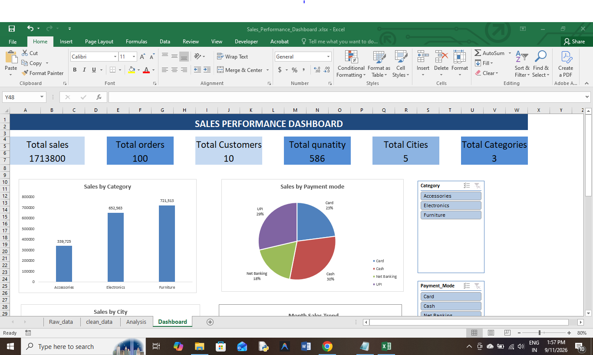
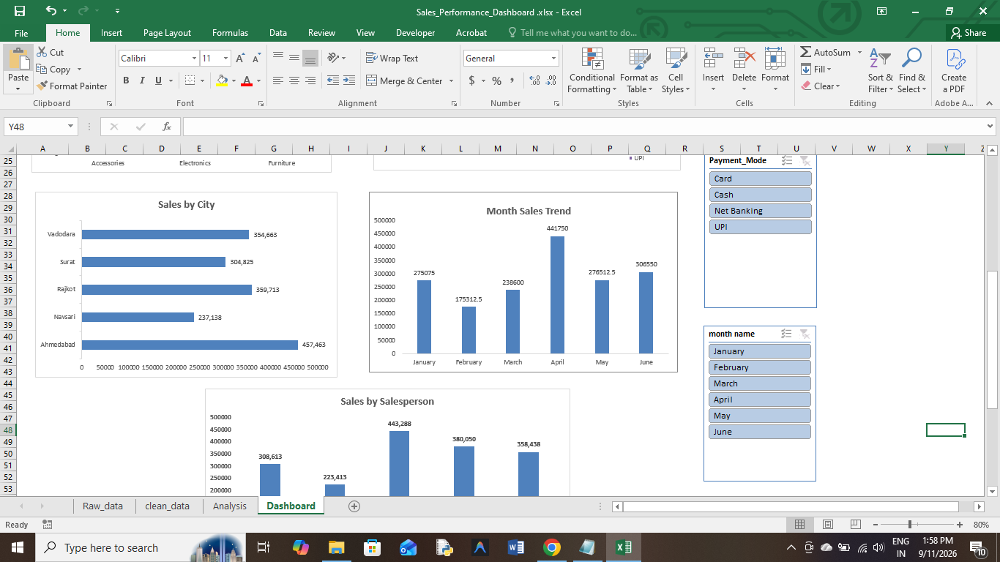
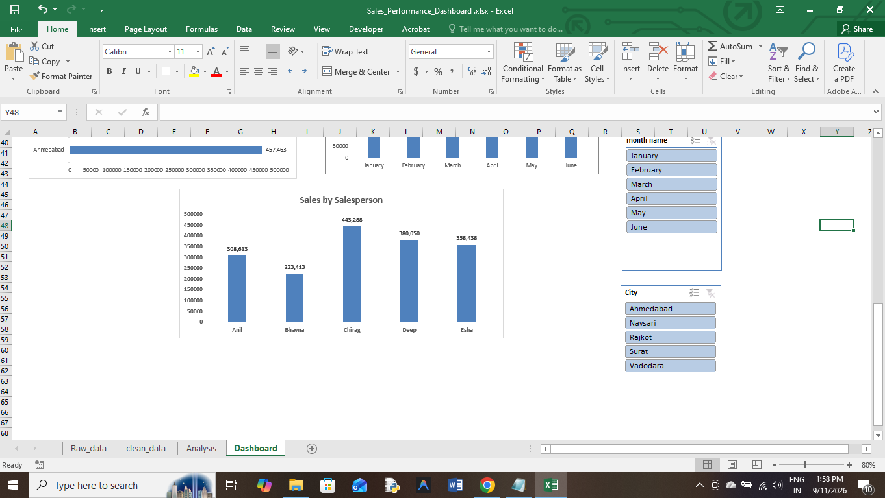
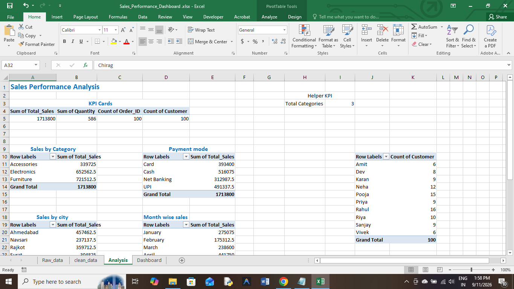
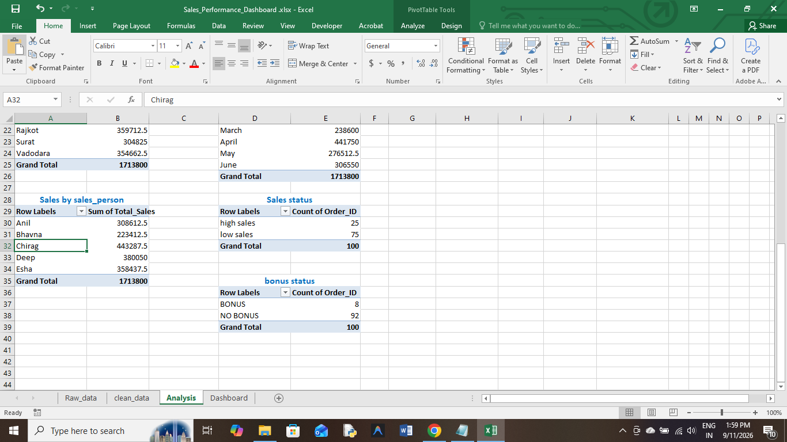
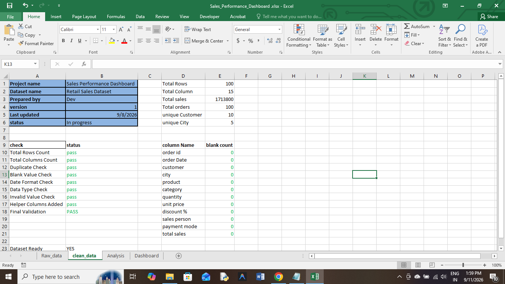

# Sales Performance Analysis Dashboard

## Project Overview

This project is an Excel-based Sales Performance Analysis Dashboard created to analyze sales transaction data and generate meaningful business insights.

The project covers data cleaning, data validation, analysis, PivotTables, PivotCharts, KPIs, and an interactive dashboard using Excel.

## Objectives

- Analyze overall sales performance
- Identify sales performance across different categories and cities
- Analyze salesperson performance
- Understand payment mode distribution
- Analyze monthly sales trends
- Create an interactive dashboard for business reporting
- Present key business metrics in a simple and professional format

## Tools Used

- Microsoft Excel
- PivotTables
- PivotCharts
- Excel Slicers
- Excel Formulas
- Data Cleaning
- Data Validation
- Data Analysis

## Dataset

The dataset contains 100 sales transaction records.

The main columns include:

- Order ID
- Order Date
- Customer
- City
- Product
- Category
- Quantity
- Unit Price
- Discount
- Sales Person
- Payment Mode
- Total Sales

## Data Cleaning

The dataset was reviewed and validated before analysis.

The cleaning process included:

- Checking total rows and columns
- Checking duplicate records
- Checking blank values
- Validating date formats
- Checking data types
- Checking invalid values
- Creating helper columns for analysis
- Performing final dataset validation

## Analysis Performed

The analysis includes:

- Overall Sales Performance
- Sales by Category
- Sales by City
- Sales by Salesperson
- Sales by Payment Mode
- Monthly Sales Trend
- Sales Status Analysis
- Bonus Status Analysis

## Dashboard

The interactive dashboard contains:

- Total Sales
- Total Orders
- Total Customers
- Total Quantity
- Total Cities
- Total Categories
- Sales by Category chart
- Sales by Payment Mode chart
- Sales by City chart
- Monthly Sales Trend chart
- Sales by Salesperson chart
- Interactive Slicers for filtering the dashboard

## Key Metrics

- Total Sales: 1,713,800
- Total Orders: 100
- Total Customers: 10
- Total Quantity: 586
- Total Cities: 5
- Total Categories: 3

## Key Insights

The dashboard helps identify sales patterns across categories, cities, salespersons, payment modes, and months.

It can be used to:

- Compare sales performance across different cities
- Identify stronger and weaker sales periods
- Compare salesperson performance
- Understand customer payment preferences
- Analyze category-level sales contribution
- Monitor overall business performance through KPIs

## Project Structure

- `Sales_Performance_Dashboard.xlsx` — Main Excel dashboard and analysis workbook
- `README.md` — Project documentation
- `Screenshots/` — Dashboard screenshots
- `Data_Analyst_Excel_Practice_Dataset.xlsx` — Original practice dataset

## Conclusion

This project demonstrates practical skills in Excel data cleaning, data validation, data analysis, visualization, PivotTables, PivotCharts, slicers, and dashboard development.

The final dashboard provides an interactive and user-friendly way to explore sales performance and support business decision-making.

## Author

Created as a Data Analytics portfolio project using Microsoft Excel.

## Screenshots

### Dashboard

### Analysis

### Data Cleaning

